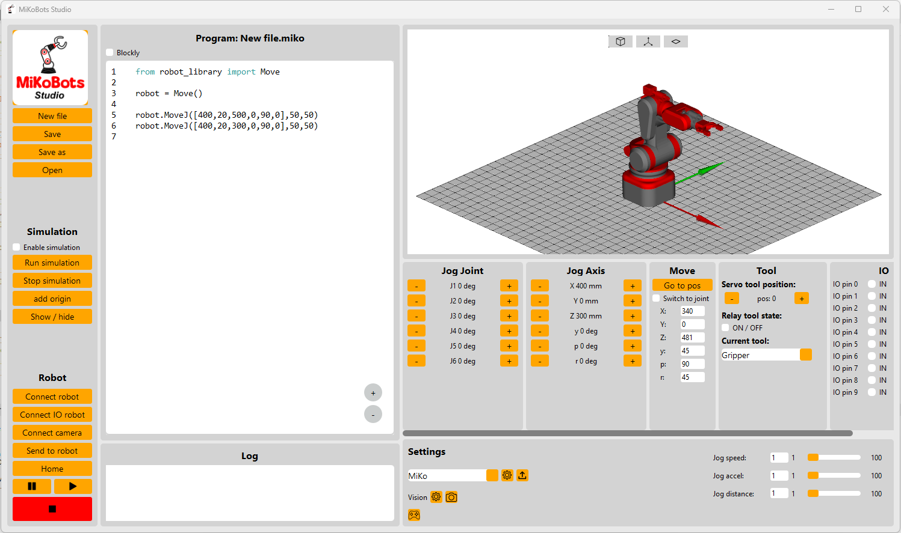

MiKoBots Studio is an opensource project, designed to control diy robot arms. So if you have designed your own robot arm and don't know how to controll it you can use MiKoBots Studio. The software has a lot of features build in to get the maximum out of tour robotic arm, like:

* Blockly programming
* Simulation, you can upload the 3d model of your robot arm and simulate it.
* Export and import robot arms, with the software you can easily configure and share your ptofile with others
* Vision control build in the librery that allows you to connect a camera to the software to give your robot eyes
* Bluetooth and usb connectivity
* Add input and output signals

At the moment the following requirements are in place if you want to control your own robot arm.

**Requirements:**
* 6 axis or 3 axis robot arm 
* Type of motor: Stepper motors
* Limit swithes: each joint should have a limit switch to set the home position
* Microcontroller: ESP32

**Version:**
The current released version and which can be donwloaded on https://mikobots.com/ is: V1.1

Currently working on a new update, this update will atleast have the follwoing updates:
* More vision function
* Play and puase button for the robot
* Automaticcly closing of the connect windows
* and fixing some bugs that appears in the earlier vesion

At the moment this update is in the test phase and will be released most likely in the week of 25 November.

**History:** 
Version: 1.1 
Date: 9-11-2024 
A lot of new updates since version 1.0, the mostimportant updates are:
* Connectivity with bluetooth
* Blockly programming 
* Seperate window for the robot settings
* Available for macOS

Version: 1.0 
Date: 1-10-2024 
First official release of MiKoBots studio.
